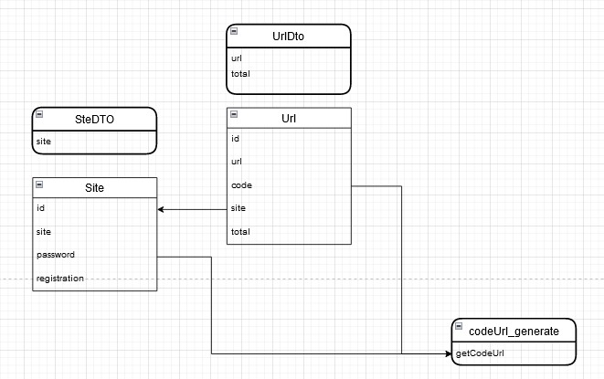
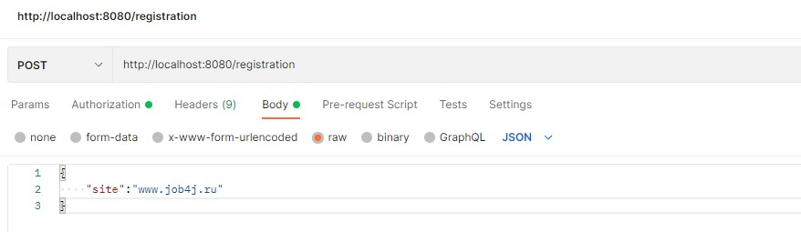
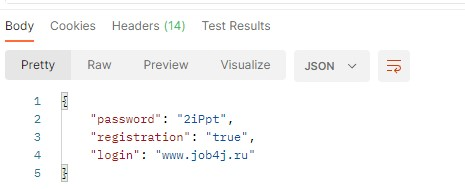
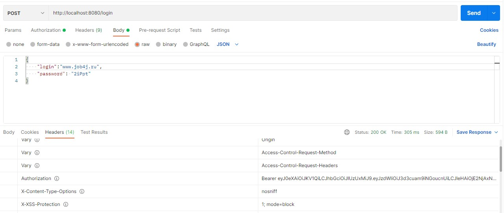
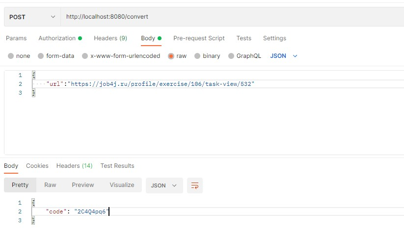
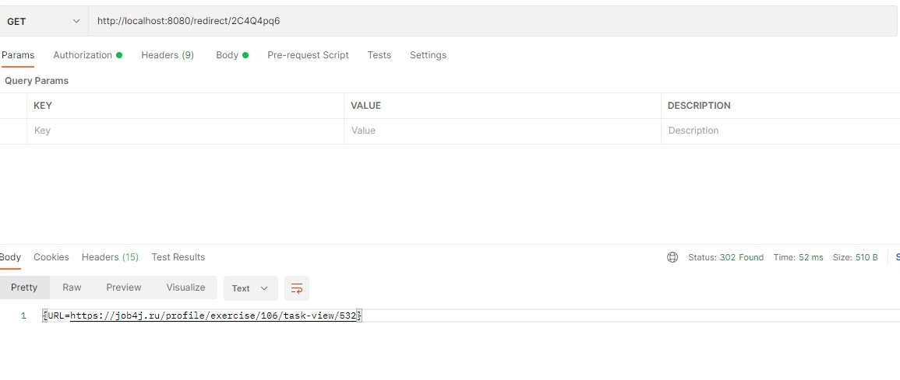
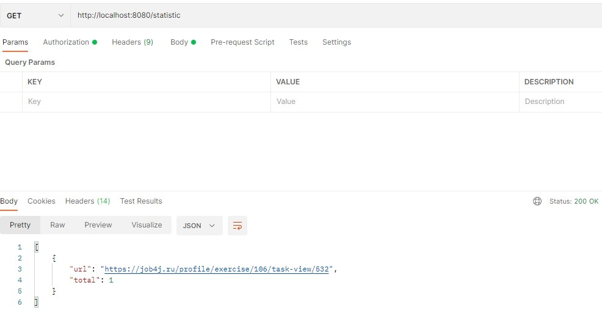

<h1>Сервис - UrlShortCut</h1>

<h3> Чтобы обеспечить безопасность пользователей, 
все ссылки на сайте заменяются ссылками на наш сервис.</h3>
<h3>Сервис работает через REST API. Для реализации используется Spring Boot 2</h3>

<h3>Для запуска проекта docker-compose:</h3>
<b> Описанные ниже действия актуальны для ОС Linux Ubuntu/Mint </b> 
1. Установите <b>docker</b> и <b>docker-compose</b>. 
2. Создайте каталог <b>projects</b>. Команда <b>mkdir projects</b>. Перейдите в каталог <b>projects</b>. Команда <b>cd projects</b>. 
3. Клонируйте репозиторий <b>job4j_url_shortcut</b>. Команда <b>git clone</b> https://github.com/Dima-Stepanov/job4j_url_shortcut. 
4. Перейдите в каталог <b>job4j_url_shortcut</b>. Команда <b>cd job4j_url_shortcut</b>.  
5. Собираем приложения. Выполняем команду <b>docker-compose build</b>. 
6. Запускаем приложения в фоновом режиме <b>docker-compose up -d</b>. 
7. Для остановки приложение выполните команду <b>docker-compose down</b>. 

<h3>Для запуска K8s</h3>
1. Клонируем проект, и заходим в каталог K8s  
2. В командной строке выполняем команду <b> bash ./commands_start.sh </b>
3. Для остановки пакетов <b> bash ./commands_destroy.sh </b>

<h2>Описание функций приложения</h2>

<h4>Общая схема модэлей приложения</h4>

  
Рисунок 1. Общая схема моделей данных  

<h4>1. Регистрация сайта.</h4>
Сервисом могут пользоваться разные сайты. 
Каждому сайту выдается пару пароль и логин. 
Чтобы зарегистрировать сайт в систему нужно отправить запроса. 
URL  
POST /registration  
C телом JSON объекта.  
{site : "job4j.ru"}  

  
Рисунок 2 запрос на регистрацию. 

<h4>Ответ от сервера. </h4>
{registration : true/false, login: УНИКАЛЬНЫЙ_КОД, password : УНИКАЛЬНЫЙ_КОД}  
Флаг registration указывает, что регистрация выполнена или нет, то есть сайт уже есть в системе.  

  
Рисунок 3 ответ от сервера при удачной регистрации. 

<h4>2. Авторизация.</h4>
Авторизацию реализована через JWT. 
Пользователь отправляет POST запрос с login и password и получает ключ. 
Этот ключ отправляет в запросе в блоке HEAD. 
Без авторизации доступны запросы POST /registration, GET /redirect/УНИКАЛЬНЫЙ_КОД. 

  
Рисунок 4 Запрос/ответ на авторизацию пользователя.  

<h4>3. Регистрация URL.</h4>
Поле того, как пользователь зарегистрировал свой сайт он может отправлять на сайт ссылки и получать преобразованные
ссылки.   
Запрос   
POST /convert   
C телом JSON объекта.   
{url: "https://job4j.ru/profile/exercise/106/task-view/532"}   
Ответ с телом JSON объекта.   
{"code":"2C4Q4pq6"}   

  
Рисунок 5. Запрос/ответ на регистрацию защищенной ссылки. 

<h4>4. Переадресация. Выполняется без авторизации.</h4>
Когда сайт отправляет ссылку с кодом в ответ вернутся ассоциированный адрес и статус 302. 
Запрос  
GET /redirect/УНИКАЛЬНЫЙ_КОД  
Ответ от сервера в заголовке.  
HTTP CODE - 302 REDIRECT URL  

  
Рисунок 6. Запрос ответ на переадресацию.  

<h4>5. Статистика.</h4>
В сервисе считается количество вызовов каждого адреса.  
По сайту можно получить статистку всех адресов и количество вызовов этого адреса.  
Статистика выходит только по адресам которые пренадлежат авторизованному пользователю.  
Запрос  
GET /statistic  
Ответ от сервера JSON.  
{  
{url : URL, total : 0},  
{url : "https://job4j.ru/profile/exercise/106/task-view/532", total : 103}  
}  

  
Рисунок 7. Запрос ответ статистики по ссылкам.  

<h4>Так же в приложении реализована валидация входных параметров</h4>
<h4>для генерации паролей и кодов для ссылок реализован класс CodeGenerate</h4>